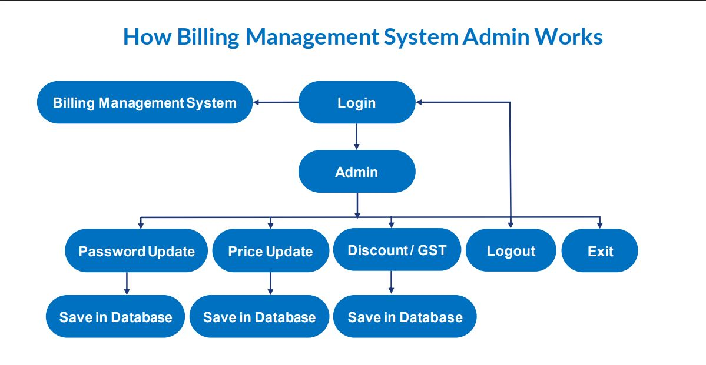
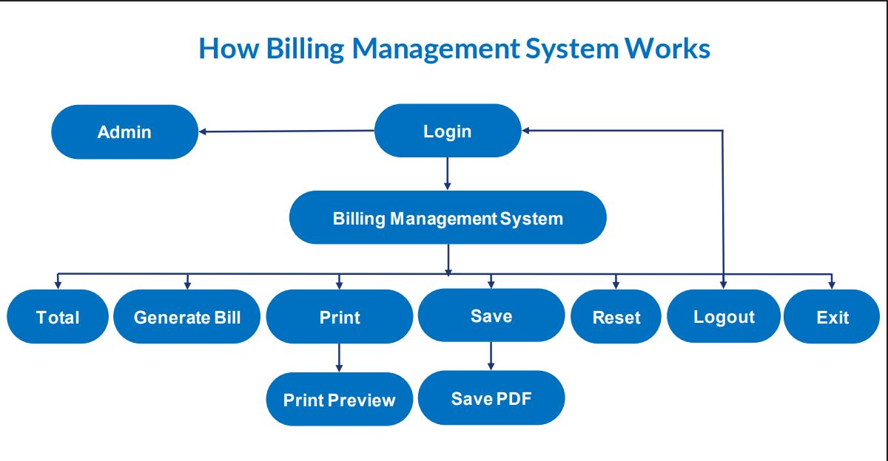
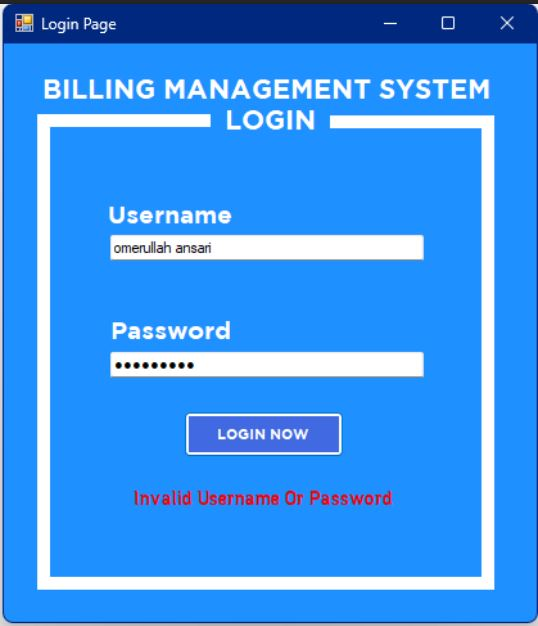
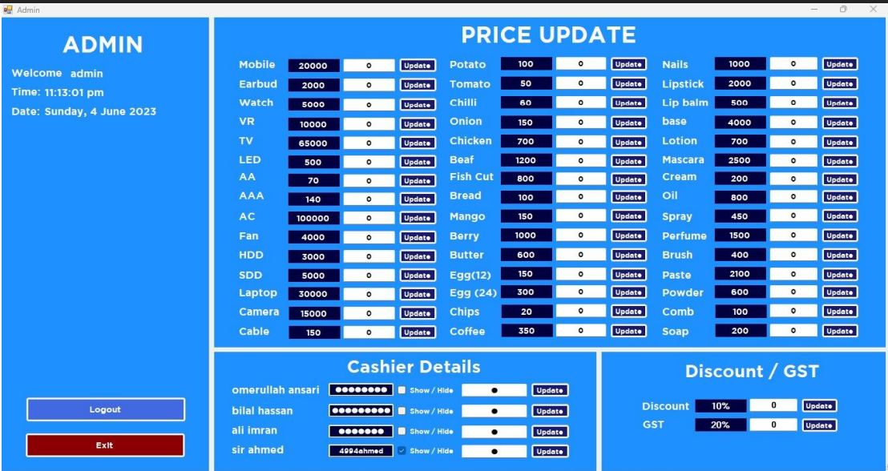
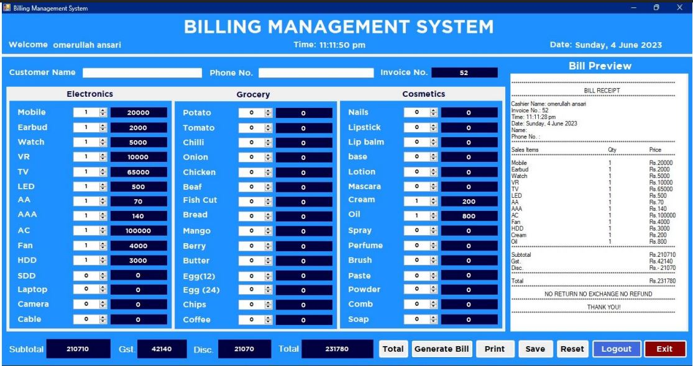
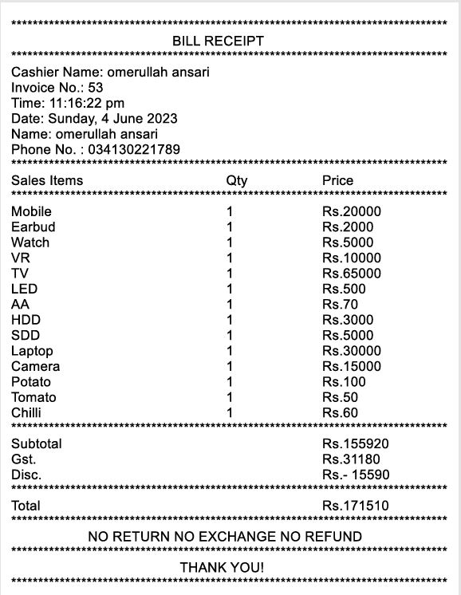

# 🧾 Billing Management System – C# Desktop Application

This project is a robust **Billing Management System** developed in **C#** as part of my academic coursework during the **first semester of my BSCS program at PAF KIET University**. It showcases my foundational skills in software development and practical application of programming concepts in a real-world context.

## 📌 Overview

The Billing Management System is a desktop-based application tailored for small to medium-sized businesses to streamline and optimize billing and customer management processes. With a user-friendly interface and efficient backend logic, it eliminates manual billing errors and enhances financial tracking.

## ✨ Key Features

- **Invoice Generation**  
  Automatically generates clean and professional invoices, reducing manual entry and ensuring accuracy.

- **Payment Tracking**  
  Monitors incoming payments and displays outstanding balances for efficient financial tracking.

- **Customer Management**  
  Stores and manages customer information, purchase history, and contact records in one place.

- **User Authentication**  
  Secures system access through a basic authentication mechanism, protecting sensitive billing data.

## 🛠️ Technologies Used

- **C# (.NET Framework)**
- **Windows Forms (WinForms)**
- **Object-Oriented Programming (OOP)**

## 🎓 Academic Context

This was my milestone project during my first semester as a Computer Science student. It helped me strengthen my programming foundation, especially in:

- Programming Fundamentals(PF)
- Object-Oriented Programming (OOP)
- File Handling
- Logic Building
- Real-world Software Development Practices

## 🔄 Workflow

This diagram explains the overall billing flow within the application:




---

## 🖥️ UI 

### 🔐 Login Screen



### 📊 Dashboards




### 📄 Invoice 



## 🚀 Getting Started

1. Clone the repository:
   ```bash
   git clone https://github.com/M-ali-imran-2003/billing-management-system.git
